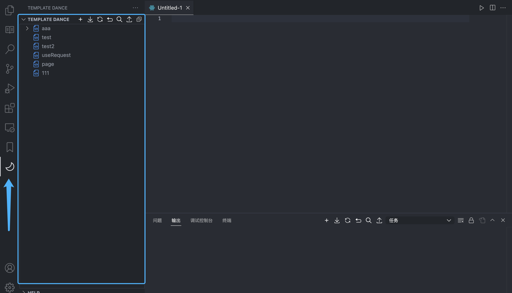
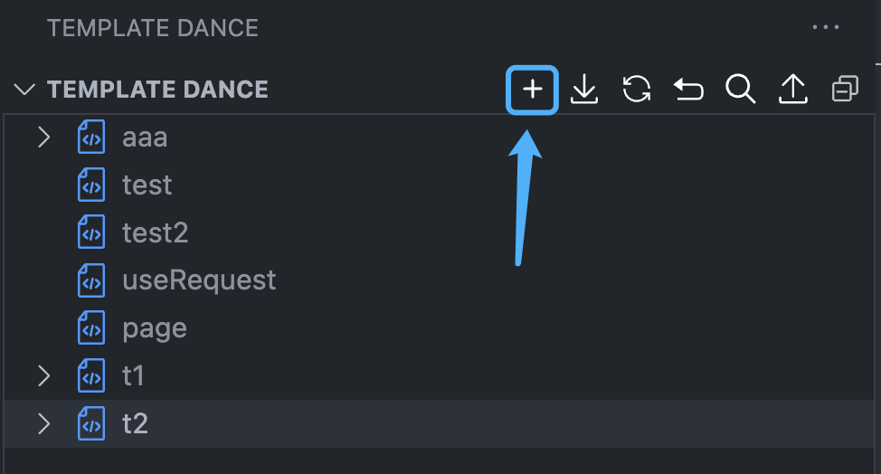
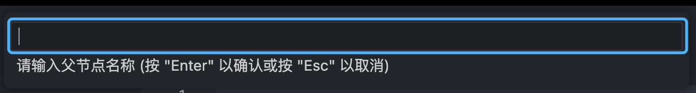
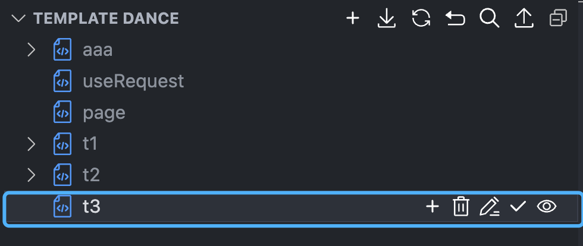
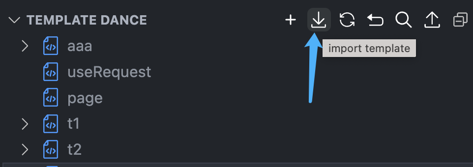
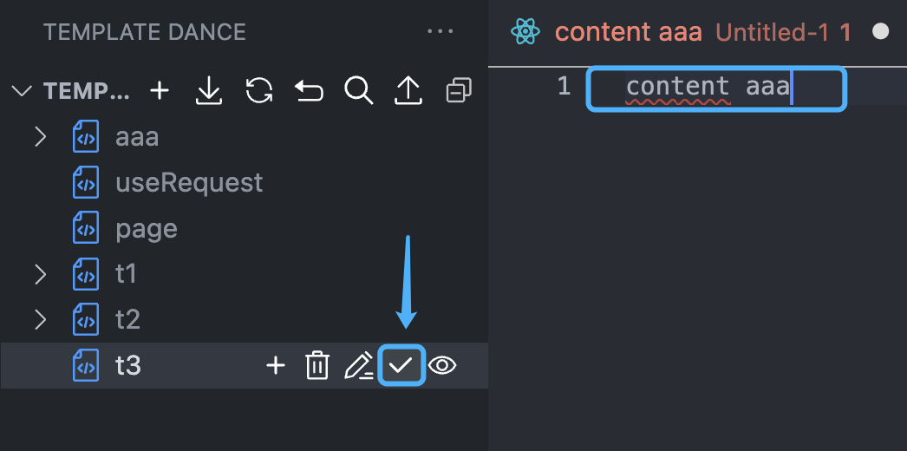

# Template-dance

**这是一个可视化的很基础的内容模板工具，可以更加直观的使用需要的模板内容，是不喜欢记命令的小可爱们的福音🎉️。**

---

## Template-dance能做什么

### 1. 创建一个template

此处新增按钮，可以直接点击，**注意：当没有选中的节点时，父节点为空。当有选中的节点时，父节点为选中节点**。

根据提示填写信息.

如要在某个节点下添加子节点，则在点击添加时，填写父节点名称。

**节点名（包括全部节点在内）不可重复。**

### 2. 导入templates

在导入之前，需要先点导出拿到模板。

### 🚧 **注意导入格式，如有报错，点击撤回，这将撤回先前导入内容，然后根据提示进行修改后再重新导入。**

### 4. 导出templates

导出当前所有节点及其内容。

### 3. 使用template

编辑窗口中，光标所在处，点击相应节点的对号，就可将内容引入其中。

### 🚧 🚧 🚧 🚧 🚧 **注意** 🚧 🚧 🚧 🚧 🚧 🚧 🚧 
**多模板同时编辑，最好是使用导入导出，尤其是编辑模板，更推荐使用导入导出功能。**
### 🚧 🚧 🚧 🚧 🚧 🚧 🚧 🚧 🚧 🚧 🚧 🚧 🚧 🚧 🚧 
